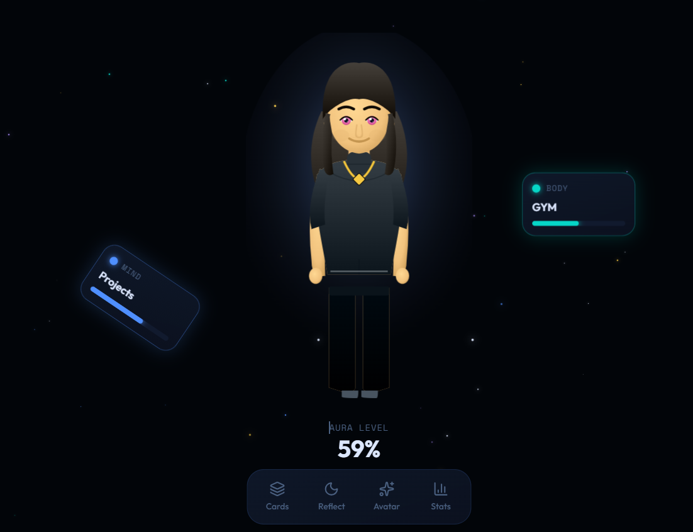
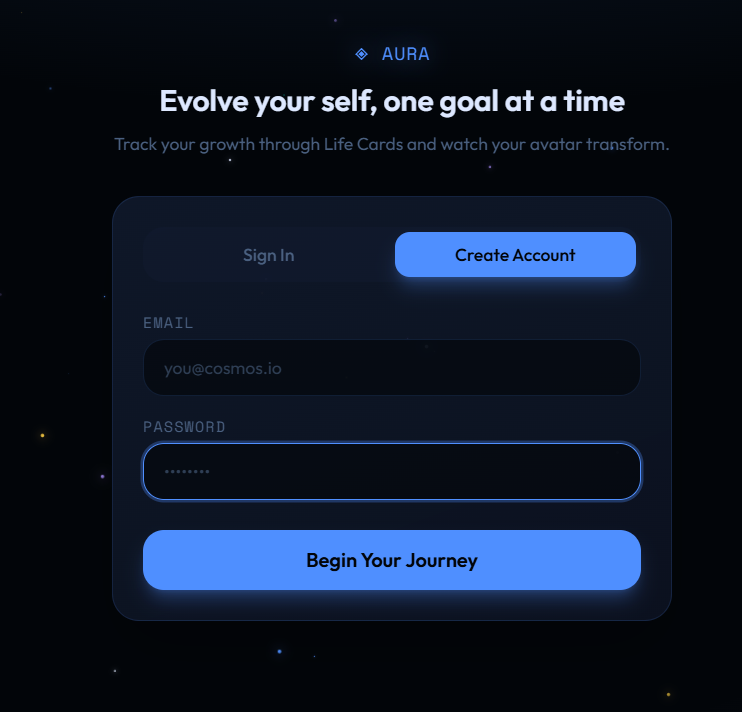

# Aura

Aura is an interactive self-growth web app that visualizes personal progress through dynamic life cards and an evolving digital avatar that reflects the user’s habits, goals, and transformation in real time.

🌐 Live Website: https://shahdnazzal.github.io/Aura/

---

## ✨ Features

- Dynamic Life Cards system to track goals and habits
- Interactive avatar that evolves based on user progress
- Real-time progress visualization
- Reflections system for personal journaling
- Modern UI with animated and responsive design
- Supabase backend integration for authentication and data storage

---

## 📸 Screenshots

### Avatar System

### Login Page

---

## 🛠️ Tech Stack

- HTML
- CSS
- JavaScript
- Supabase (Auth + Database)
- SVG-based avatar rendering

---

## 🚀 How It Works

Aura connects your personal progress with a visual identity system. Every action you take (tasks, reflections, habits) directly influences your avatar and overall aura level, making self-development interactive and visual.

---

## 📂 Project Structure

aura.html → Main application file
avatar.png → Avatar preview
log_in.png → Login screen
sign_in.png → Signup screen
UI.png → Main interface preview

---

## 🔗 Deployment

Deployed using GitHub Pages:
https://shahdnazzal.github.io/Aura/

---

## 💡 Purpose

The goal of Aura is to transform self-growth into a visual, engaging, and gamified experience that motivates consistency and personal evolution.

---

## 📜 License

This project is for educational and personal development purposes.
